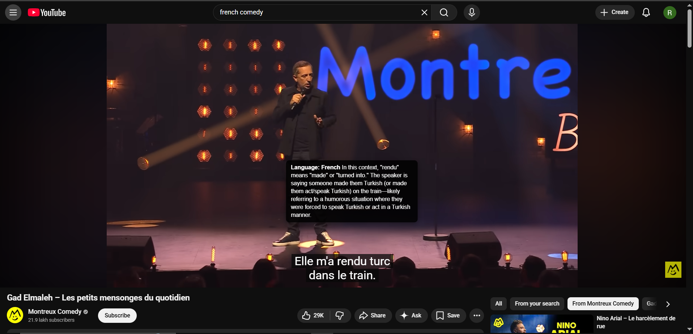

# LinguaLens

A Chrome extension that helps you learn foreign languages while watching YouTube. Click any word in the subtitles to get a contextual explanation in English — not a dictionary translation, but a real explanation that handles idioms, slang, and cultural references correctly.



---

## Features

- **Click any word** in YouTube subtitles for an instant contextual explanation
- **Any language** — language is detected automatically from the subtitle text
- **Pauses the video** on click so you have time to read
- **Smart caching** — repeated words are answered instantly from local cache, no API call needed
- **Provider agnostic** — works with OpenRouter, OpenAI, Anthropic, Grok, Groq, Ollama, or any OpenAI-compatible endpoint
- **Subtitle history context** — the last 4 subtitle lines are sent with each request so the LLM understands what the conversation was about

---

## Installation

LinguaLens is not yet on the Chrome Web Store. Load it manually as an unpacked extension:

1. Clone or download this repository
2. Open Chrome and go to `chrome://extensions`
3. Enable **Developer mode** (toggle in the top-right corner)
4. Click **Load unpacked** and select the project folder
5. The LinguaLens icon will appear in your toolbar

---

## Setup

1. Click the LinguaLens icon in the Chrome toolbar
2. Select your provider from the dropdown
3. Paste your API key
4. Set a model name (or leave blank to use the default for that provider)
5. Click **Save Settings**

### Recommended free option

Sign up at [openrouter.ai](https://openrouter.ai), get a free API key, and use model:

```
openrouter/free
```

---

## Usage

1. Open any YouTube video and enable captions (`CC` button)
2. Select a foreign language caption track
3. Click any word in the subtitle while the video plays
4. A tooltip appears above the word with a contextual explanation
5. Click anywhere to dismiss the tooltip and resume the video

---

## Supported Providers

| Provider | Notes |
|---|---|
| OpenRouter | Free tier available — recommended for getting started |
| OpenAI | Requires paid API key |
| Anthropic | Requires paid API key |
| Grok (xAI) | Requires xAI API key |
| Groq | Fast inference, free tier available |
| Ollama | Runs locally, no API key needed |
| Custom | Any OpenAI-compatible endpoint |

---

## Tech Stack

- Vanilla JavaScript — no build step, no bundler
- Chrome Extension Manifest V3
- MutationObserver for real-time subtitle interception
- `chrome.storage.local` for API key storage
- `localStorage` for explanation caching (FIFO eviction, 2000 entry cap)
- Background service worker as fetch proxy to avoid CORS issues

---

## Project Structure

```
LinguaLens/
├── manifest.json     # Extension config, permissions
├── content.js        # Subtitle observer, word wrapping, tooltip, caching
├── background.js     # LLM API fetch proxy (runs as service worker)
├── popup.html        # Settings UI
└── popup.js          # Settings load/save logic
```

---

## License

MIT
